# Диаграммы: Структуры данных Python

## 🏗️ Общая архитектура структур данных

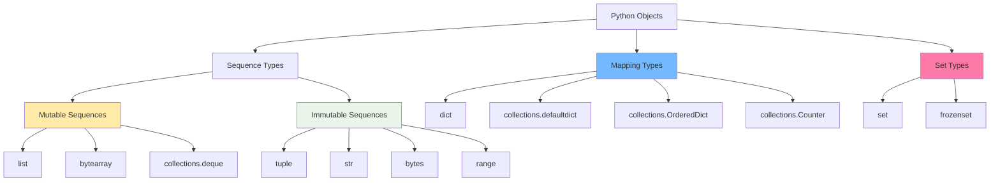

## 📋 Внутренняя структура списка

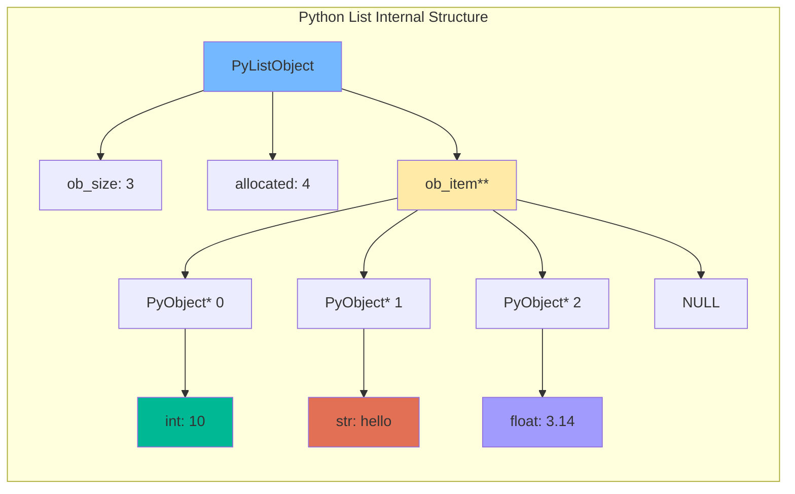

## 🔄 Операции со списками - сложность

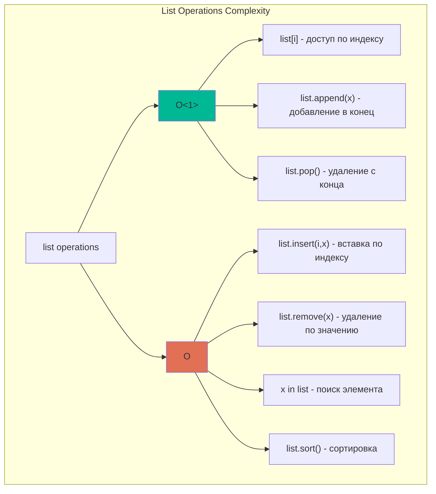

## 🎯 Сравнение структур данных

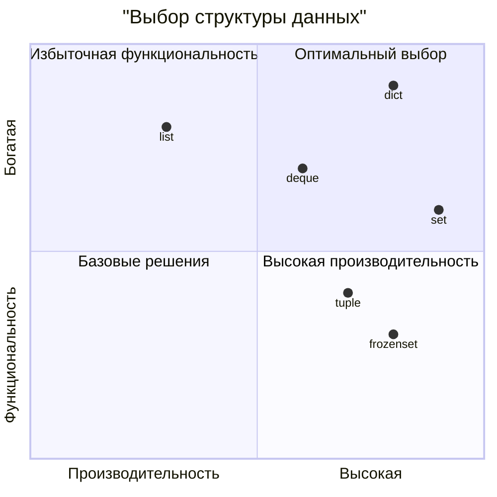

## 🔗 Жизненный цикл кортежа

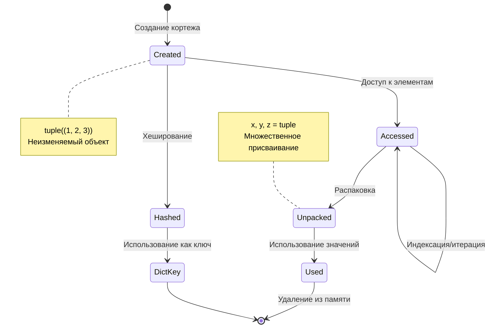

## 📖 Архитектура словаря (Python 3.7+)

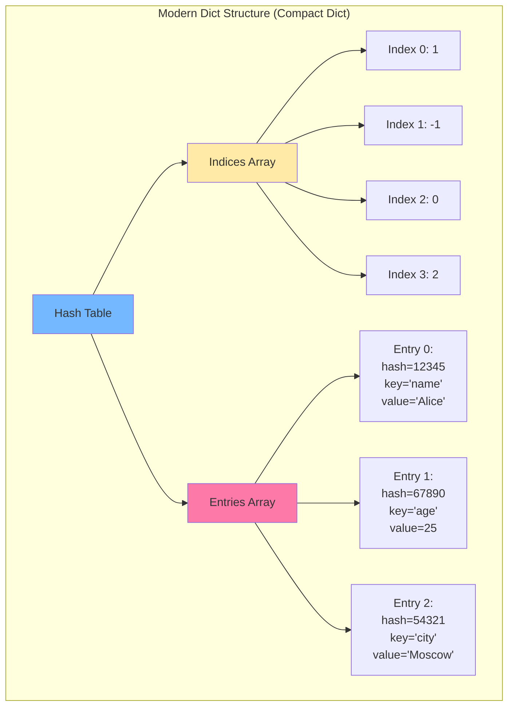

## 🎯 Операции с множествами

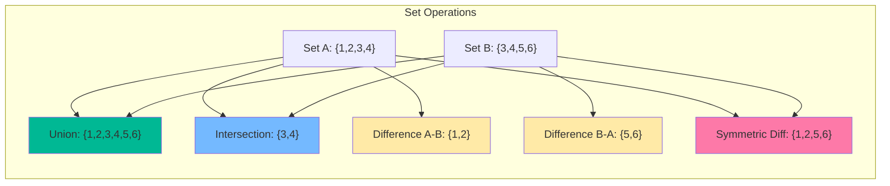

## 🔄 Процесс хеширования в множествах и словарях

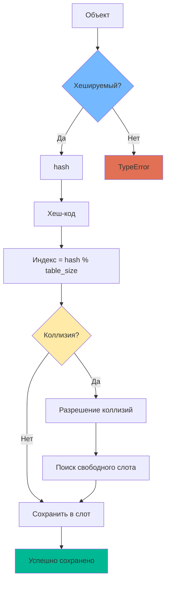

## 📊 Производительность операций

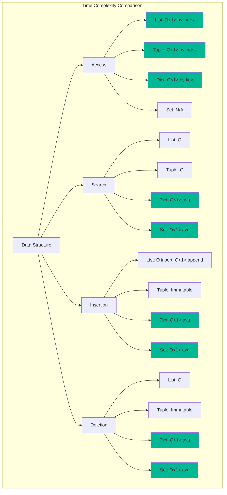

## 🧠 Схема выбора структуры данных

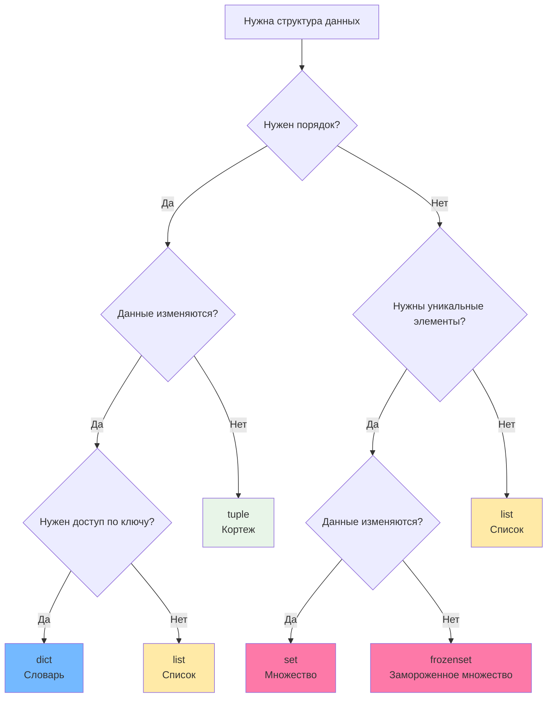

## 🔄 Пример работы со срезами

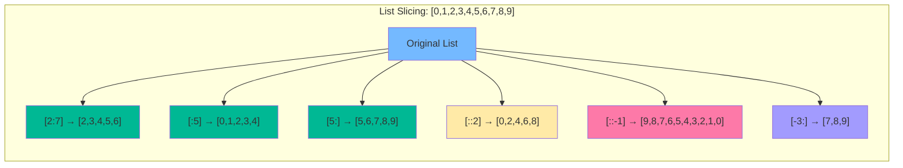

## 📈 Рост динамического массива (список)

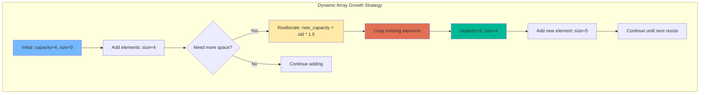

## 🎭 Паттерны использования коллекций

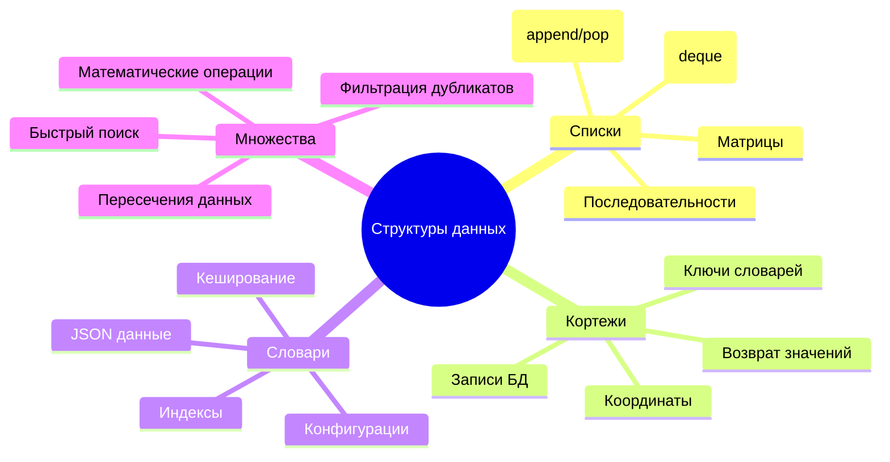

## 🔄 Жизненный цикл объектов в коллекциях

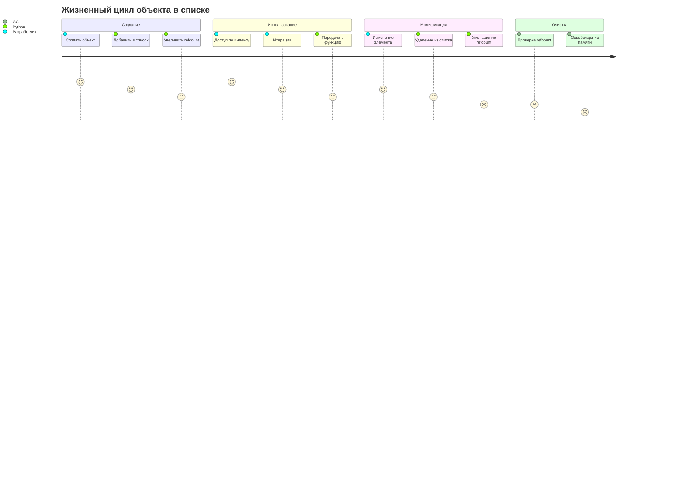

## 🏛️ Архитектура collections.deque

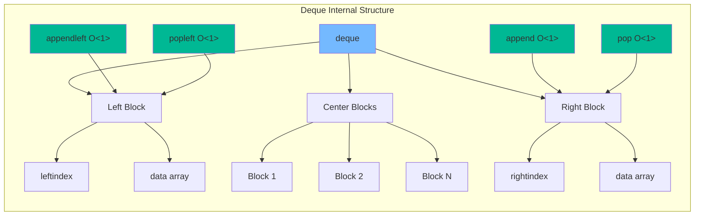

## 🎯 Оптимизация выбора коллекций

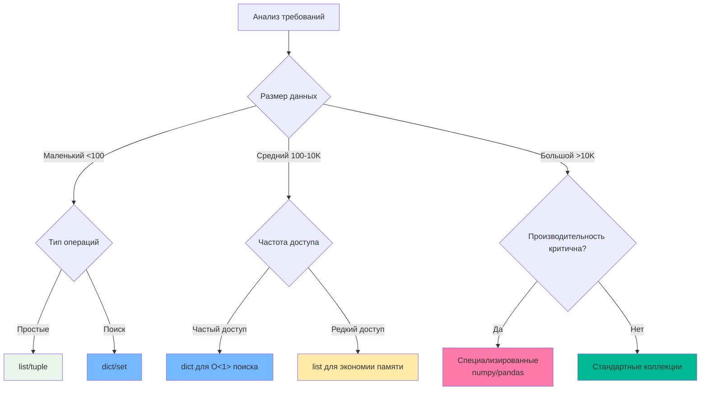