# Диаграммы: Объектно-ориентированное программирование в Python

## 🏗️ Основы ООП - Четыре столпа

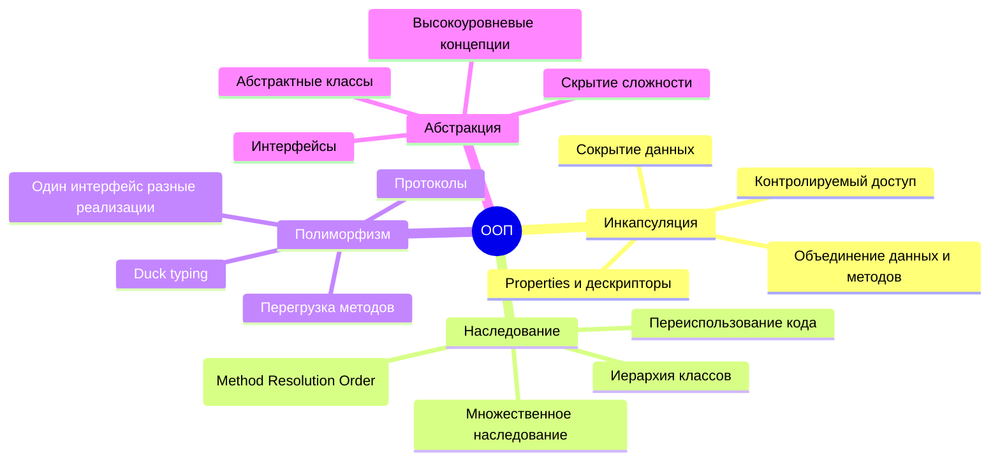

## 🏭 Архитектура класса Python

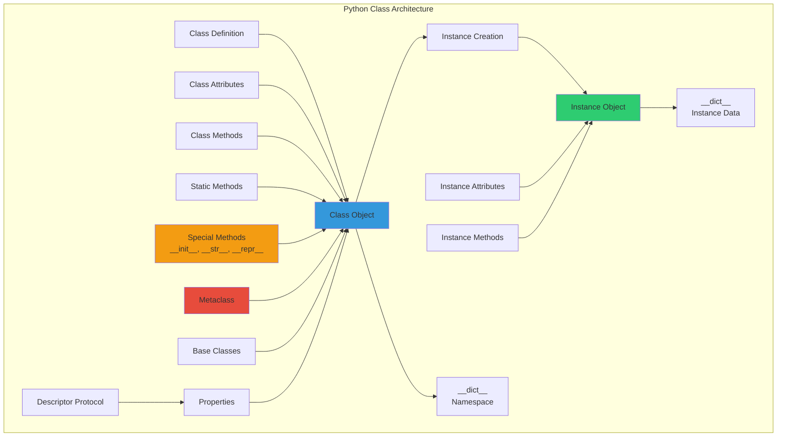

## 🧬 Наследование и MRO (Method Resolution Order)

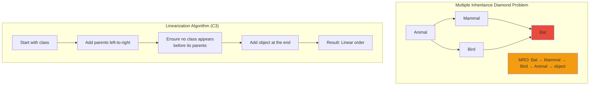

## 🔄 Жизненный цикл объекта

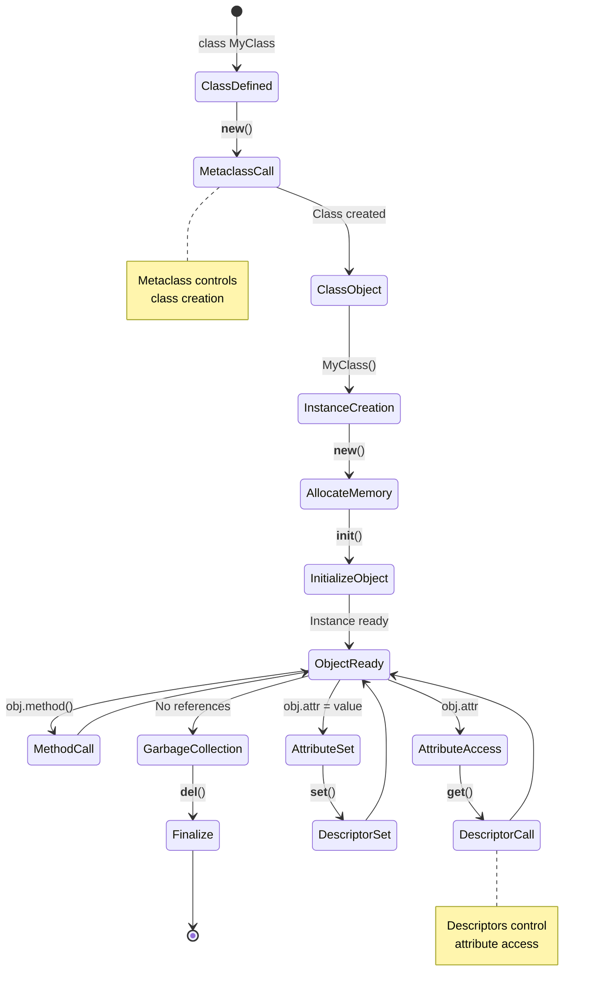

## 🎭 Полиморфизм в действии

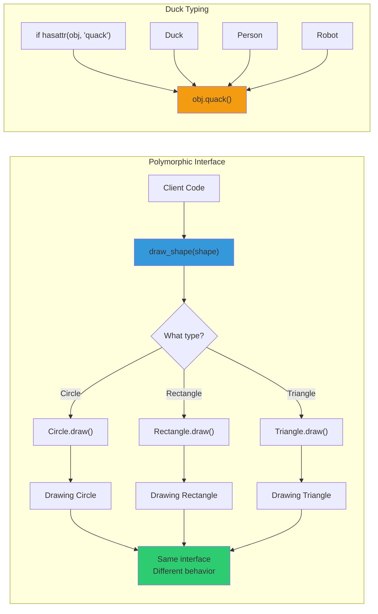

## 🔒 Инкапсуляция и уровни доступа

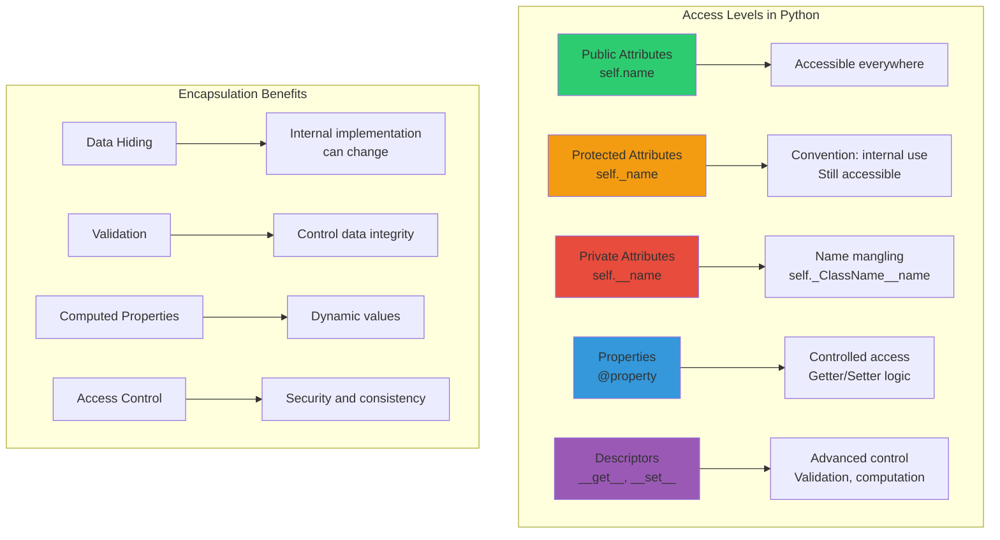

## 🏛️ Абстрактные классы и интерфейсы

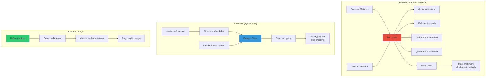

## 🎯 Специальные методы (Magic Methods)

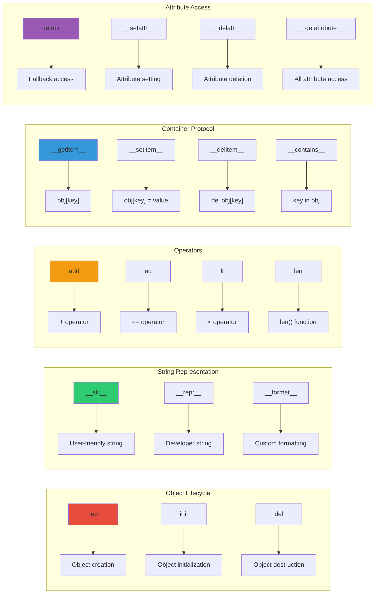

## 🔧 Дескрипторы - протокол доступа к атрибутам

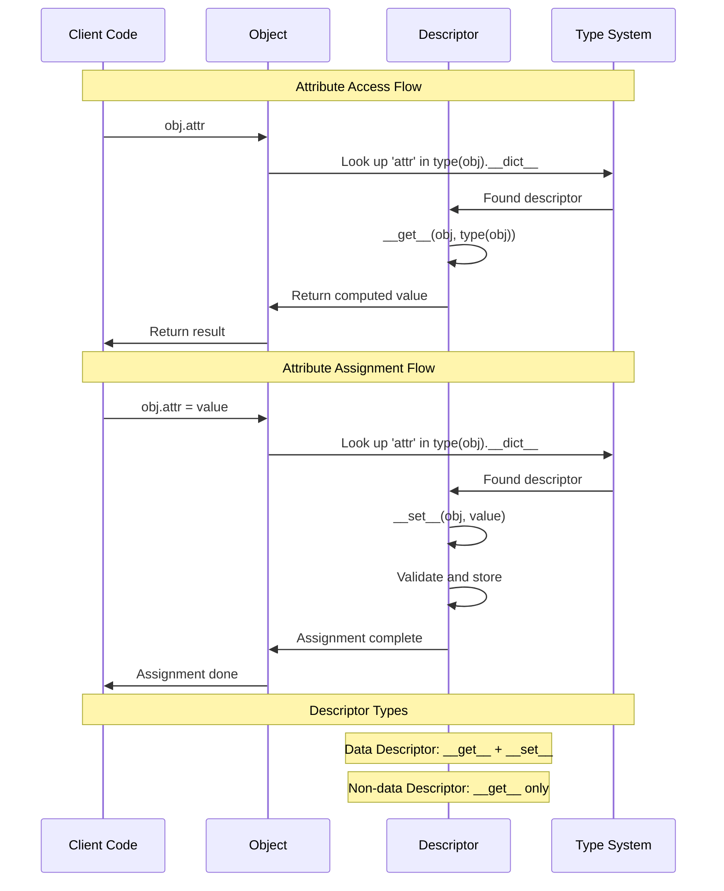

## 🏗️ Метаклассы - классы классов

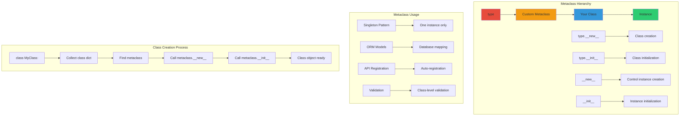

## 🔄 Паттерны проектирования в ООП

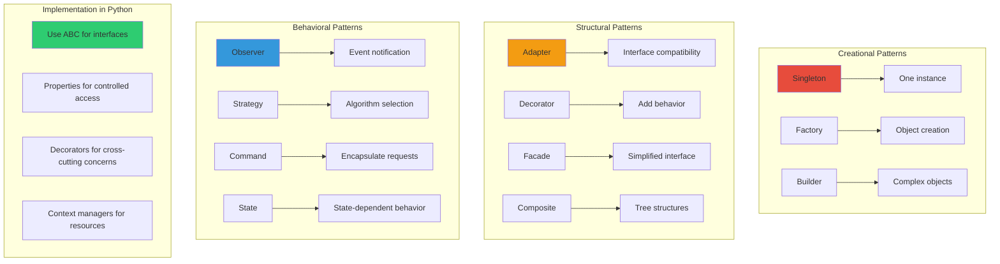

## 🎨 Композиция vs Наследование

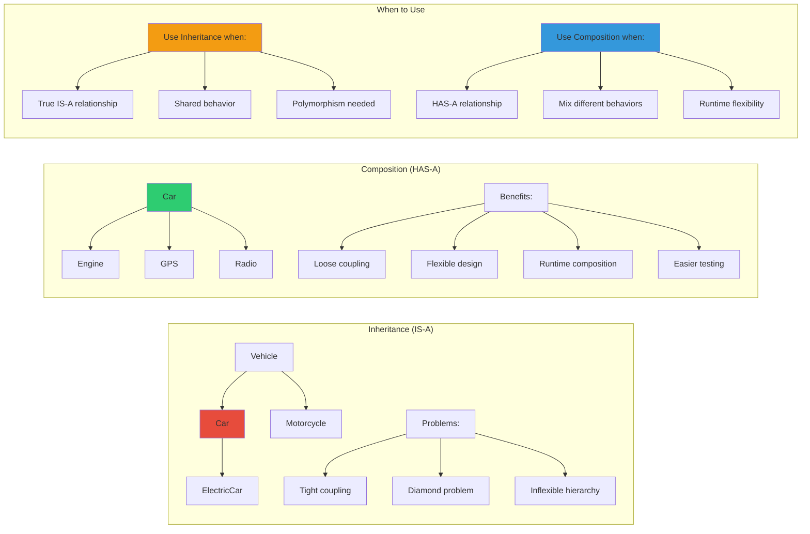

## 📊 Сравнение подходов к ООП

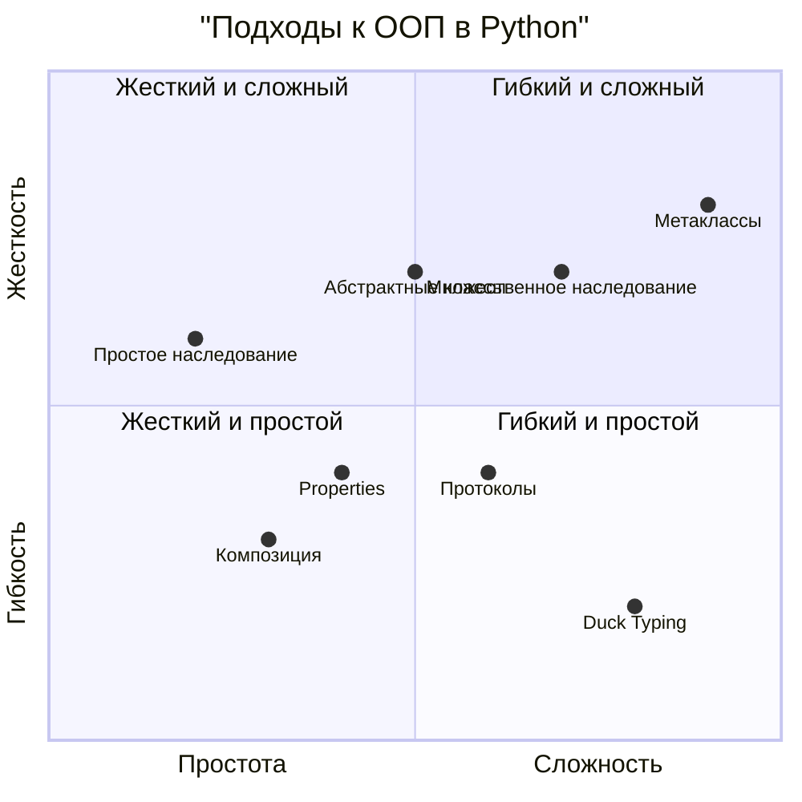

## 🔄 Жизненный цикл разработки ООП

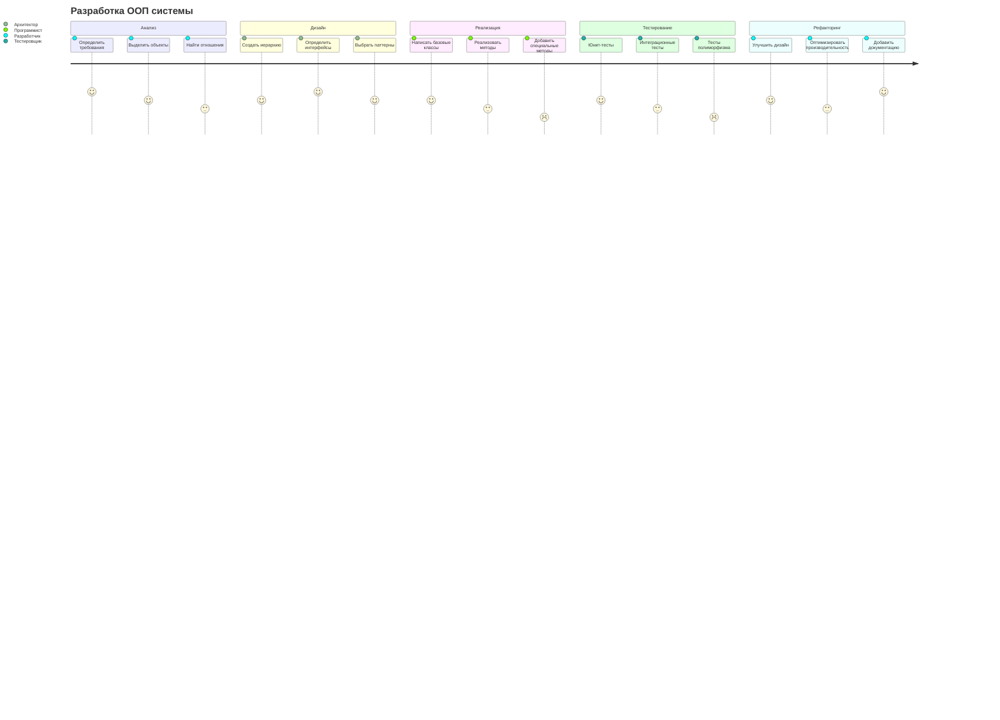

## 🎯 Принципы SOLID в Python

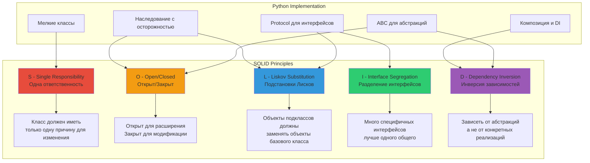

## 🔄 Процесс создания и вызова методов

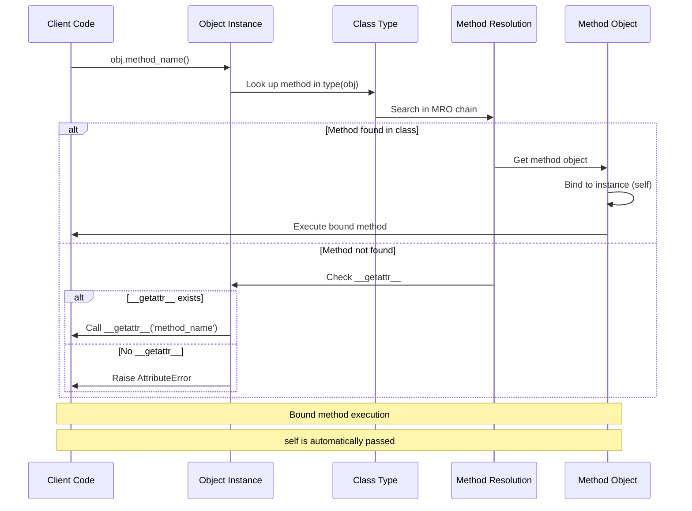

## 🧩 Компоненты системы ООП

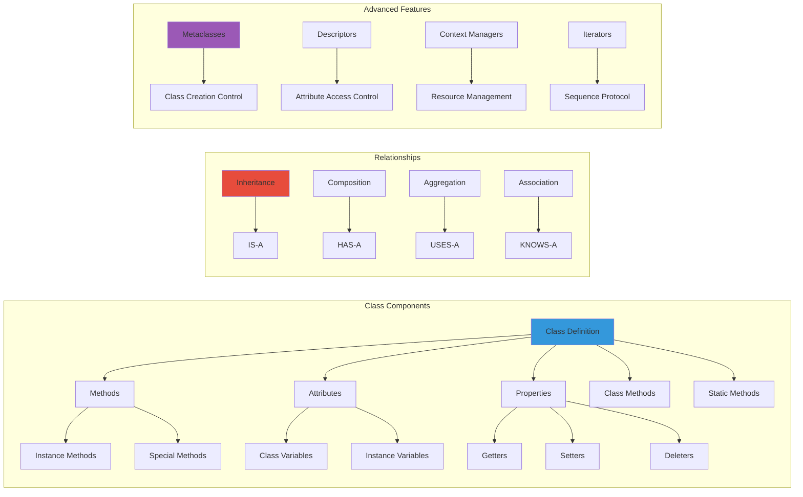

## 📈 Эволюция ООП подходов в Python

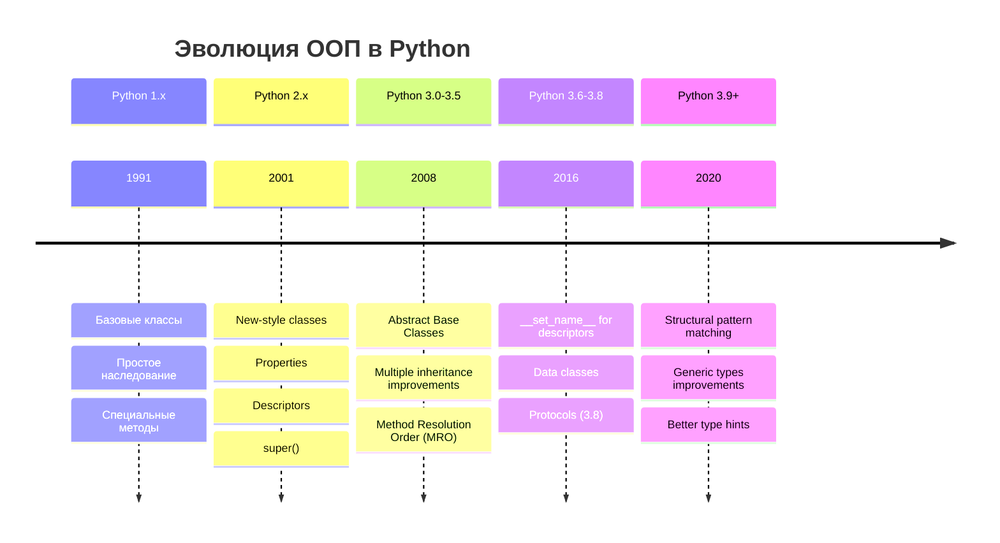