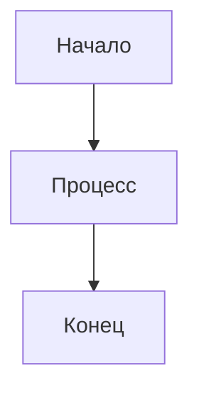
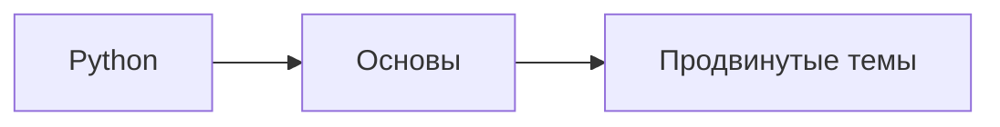

# 🚀 Руководство по развертыванию курса Python

## 🌐 **Рекомендуемые платформы**

### 1. **GitHub Pages** ⭐⭐⭐⭐⭐ (РЕКОМЕНДУЕТСЯ)

**Преимущества:**
- ✅ Бесплатно
- ✅ Отличная поддержка Mermaid диаграмм
- ✅ Подсветка синтаксиса Python
- ✅ Jupyter notebooks отображаются корректно
- ✅ Автоматический деплой через GitHub Actions
- ✅ Версионирование через Git

**Пошаговая инструкция:**

#### Шаг 1: Подготовка репозитория
```bash
# Создайте новый репозиторий на GitHub
# Название: python-course
# Описание: Полный курс Python от основ до продвинутых техник
# Публичный репозиторий
```

#### Шаг 2: Загрузка файлов
```bash
# Клонируйте репозиторий
git clone https://github.com/your-username/python-course.git
cd python-course

# Скопируйте все файлы курса в папку
# Добавьте созданные файлы конфигурации

# Закоммитьте изменения
git add .
git commit -m "Initial commit: Python course"
git push origin main
```

#### Шаг 3: Настройка GitHub Pages
1. Перейдите в Settings → Pages
2. Source: Deploy from a branch
3. Branch: gh-pages
4. Folder: / (root)
5. Save

#### Шаг 4: Проверка деплоя
- GitHub Actions автоматически соберет сайт
- Сайт будет доступен по адресу: `https://your-username.github.io/python-course`

### 2. **GitBook** ⭐⭐⭐⭐⭐

**Преимущества:**
- ✅ Специализированная платформа для документации
- ✅ Встроенная поддержка Mermaid
- ✅ Отличная навигация
- ✅ Экспорт в PDF

**Инструкция:**
1. Зарегистрируйтесь на [gitbook.com](https://gitbook.com)
2. Создайте новый Space
3. Импортируйте файлы из репозитория
4. Настройте навигацию в sidebar
5. Опубликуйте

### 3. **Notion** ⭐⭐⭐⭐

**Преимущества:**
- ✅ Современный интерфейс
- ✅ Встроенная поддержка кода
- ✅ Диаграммы через Mermaid
- ✅ Коллаборация

**Инструкция:**
1. Создайте новую страницу в Notion
2. Импортируйте Markdown файлы
3. Настройте навигацию
4. Опубликуйте страницу

### 4. **Read the Docs** ⭐⭐⭐⭐

**Преимущества:**
- ✅ Профессиональная платформа
- ✅ Автоматическая сборка
- ✅ Версионирование
- ✅ Поиск

**Инструкция:**
1. Создайте аккаунт на [readthedocs.org](https://readthedocs.org)
2. Подключите GitHub репозиторий
3. Настройте конфигурацию Sphinx
4. Автоматический деплой

### 5. **Vercel + Next.js** ⭐⭐⭐⭐

**Преимущества:**
- ✅ Полный контроль над дизайном
- ✅ Отличная производительность
- ✅ Кастомные компоненты

**Инструкция:**
1. Создайте Next.js проект
2. Настройте Markdown рендеринг
3. Добавьте поддержку Mermaid
4. Деплой на Vercel

## 🔧 **Техническая подготовка**

### Настройка MkDocs (для GitHub Pages)

#### Установка зависимостей:
```bash
pip install mkdocs-material
pip install mkdocs-mermaid2-plugin
pip install mkdocs-awesome-pages-plugin
```

#### Локальная проверка:
```bash
# Запустите локальный сервер
mkdocs serve

# Откройте http://127.0.0.1:8000
```

### Настройка Mermaid диаграмм

Убедитесь, что диаграммы корректно отображаются:

```markdown

```

## 📊 **Сравнение платформ**

| Платформа | Стоимость | Mermaid | Код | Jupyter | Навигация | Простота |
|-----------|-----------|---------|-----|---------|-----------|----------|
| **GitHub Pages** | Бесплатно | ✅ | ✅ | ✅ | ✅ | ⭐⭐⭐⭐⭐ |
| **GitBook** | Бесплатно | ✅ | ✅ | ⚠️ | ✅ | ⭐⭐⭐⭐ |
| **Notion** | Бесплатно | ✅ | ✅ | ❌ | ⚠️ | ⭐⭐⭐ |
| **Read the Docs** | Бесплатно | ⚠️ | ✅ | ✅ | ✅ | ⭐⭐⭐ |
| **Vercel** | Бесплатно | ✅ | ✅ | ✅ | ✅ | ⭐⭐ |

## 🎯 **Моя рекомендация: GitHub Pages**

**Почему именно GitHub Pages:**

1. **Бесплатность** - полная функциональность без ограничений
2. **Надежность** - инфраструктура GitHub
3. **Простота** - автоматический деплой
4. **Гибкость** - полный контроль над контентом
5. **Сообщество** - легко делиться и получать обратную связь

## 🚀 **Быстрый старт с GitHub Pages**

### 1. Создайте репозиторий
```bash
# На GitHub создайте репозиторий python-course
```

### 2. Клонируйте и настройте
```bash
git clone https://github.com/your-username/python-course.git
cd python-course

# Добавьте все файлы курса
git add .
git commit -m "Add Python course"
git push origin main
```

### 3. Настройте GitHub Pages
- Settings → Pages
- Source: Deploy from a branch
- Branch: gh-pages
- Save

### 4. Проверьте результат
- Сайт будет доступен через 5-10 минут
- URL: `https://your-username.github.io/python-course`

## 🔍 **Проверка корректности отображения**

### Диаграммы Mermaid
```markdown

```

### Код Python
```python
def hello_world():
    print("Hello, World!")
```

### Jupyter Notebooks
- Убедитесь, что `.ipynb` файлы корректно отображаются
- Проверьте интерактивные элементы

## 📈 **Аналитика и мониторинг**

### GitHub Pages
- Встроенная аналитика через GitHub Insights
- Просмотр трафика и популярных страниц

### Google Analytics
```html
<!-- Добавьте в mkdocs.yml -->
extra:
  analytics:
    provider: google
    property: G-XXXXXXXXXX
```

## 🎉 **Результат**

После настройки у вас будет:
- ✅ Красивый сайт с курсом
- ✅ Корректное отображение диаграмм
- ✅ Подсветка синтаксиса
- ✅ Адаптивный дизайн
- ✅ Поиск по контенту
- ✅ Навигация по разделам

**Ваш курс будет доступен по адресу:**
`https://your-username.github.io/python-course`

## 🆘 **Решение проблем**

### Проблема: Диаграммы не отображаются
**Решение:** Проверьте синтаксис Mermaid и убедитесь, что плагин установлен

### Проблема: Код не подсвечивается
**Решение:** Укажите язык в блоках кода: ```python

### Проблема: Сайт не обновляется
**Решение:** Проверьте GitHub Actions и убедитесь, что деплой прошел успешно

## 🎯 **Следующие шаги**

1. **Выберите платформу** (рекомендую GitHub Pages)
2. **Следуйте инструкции** по настройке
3. **Проверьте отображение** всех элементов
4. **Поделитесь ссылкой** с сообществом
5. **Собирайте обратную связь** и улучшайте курс

Удачи с размещением вашего отличного курса! 🚀 